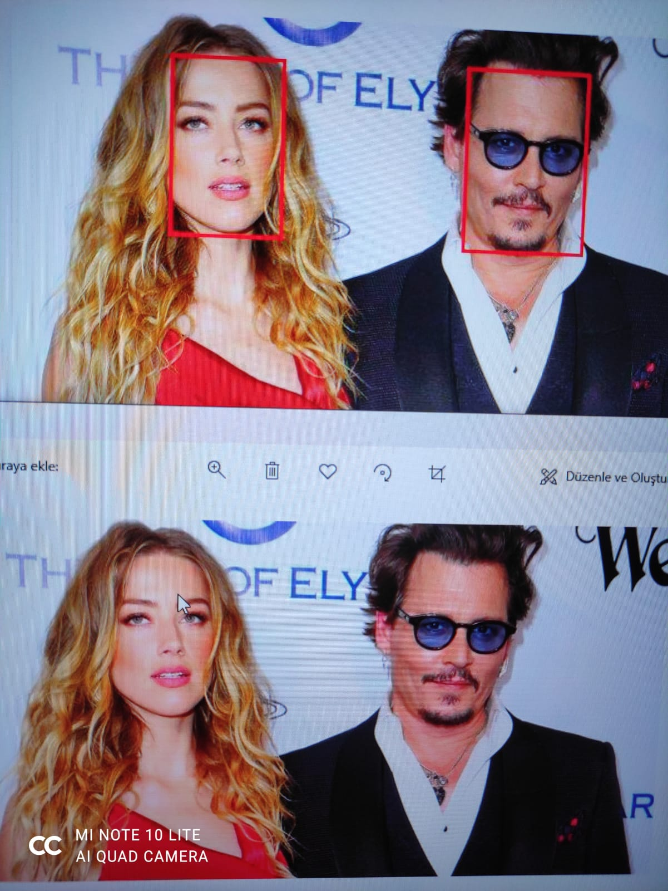

# Detecting-Faces-with-Amazon-Rekognition-Spring-Boot
Detecting Faces and Drawing Bounding Boxes around them using Amazon Rekognition API with Spring Boot

Note that application returns base64 encoded string of image.

## Example

